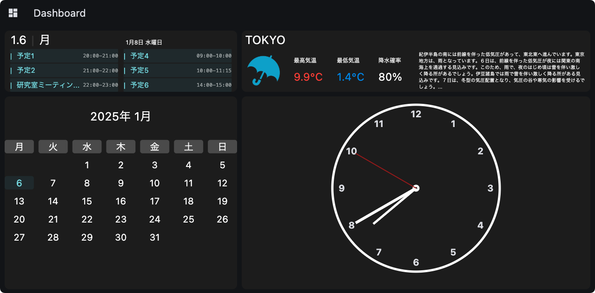
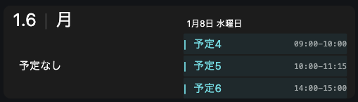
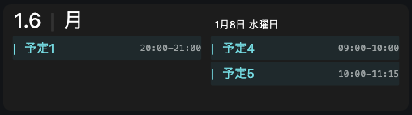

# Dashboard

## Dashboardの概要
[GoogleCalendarの直近の予定](#googlecalendarの直近の予定)と[天気情報](#天気情報)，[今月のカレンダー](#今月のカレンダー)，[アナログ時計](#アナログ時計)を表示する．

## 使用方法
1. 天気アイコンの取得と作成  
    [7種類の天気アイコン](#天気アイコンの一覧)をimgsフォルダに保存したのちにweather_icons.ipynbファイルを用いて[全ての天気コード](https://weather.yukigesho.com/code.html)に対応する画像を作成する．
2. Google Calendarの情報を取得するための設定  
    [Google Calendar for Develop](https://developers.google.com/calendar/api/quickstart/python?hl=ja#set_up_your_environment)のPython quickstartの環境のセットアップを行う．手順に従うと`credentials.json`をダウンロードできるため，main.pyと同じ高さに保存する．
3. 実行  
    ターミナルで`main.py`を実行する．

## 表示する内容の詳細

### GoogleCalendarの直近の予定
今日の予定と次に予定がある日の予定を３件ずつ表示する．
- 今日の予定がない場合は「**予定なし**」と表示される．  
    
- 予定が3件未満の場合は数件のみ表示される．  
    

### 天気情報
気象庁から手に入れた東京都の最高気温と最低気温，降水確率，天気の概要情報を表示する．
- 最高気温と最低気温，降水確率は`https://www.jma.go.jp/bosai/forecast/data/forecast/130000.json`から取得
- 天気の概要情報は`https://www.jma.go.jp/bosai/forecast/data/overview_forecast/130000.json`から取得

- 天気アイコンは[ICOON MONO](https://icooon-mono.com/?s=weather)から取得した画像を用いて作成する(再配布禁止のためアップロードはしていない)．
以下の7種類の画像をimgsフォルダに保存したのちにweather_icons.ipynbファイルを用いて全ての天気コードに対応する画像を作成する．  
    #### 天気アイコンの一覧
    - 晴れ(sun.png) rgb(223,86,86) : https://icooon-mono.com/16073-%e5%a4%aa%e9%99%bd%e3%82%a2%e3%82%a4%e3%82%b3%e3%83%b3/
    - くもり(cloud.png) rgb(75,75,75) : https://icooon-mono.com/16083-%e5%a4%a9%e6%b0%97%e8%a8%98%e5%8f%b710/
    - 雨(rain.png) rgb(58,171,210) : https://icooon-mono.com/00071-%e5%a4%a9%e6%b0%97%e3%80%81%e9%9b%a8%e3%81%ae%e3%82%a2%e3%82%a4%e3%82%b3%e3%83%b3%e7%b4%a0%e6%9d%90/
    - 雪(snow.png) rgb(255,255,255) : https://icooon-mono.com/14255-%e9%9b%aa%e3%81%a0%e3%82%8b%e3%81%be%e3%82%a2%e3%82%a4%e3%82%b3%e3%83%b36/
    - 霧(fog.png) rgb(75,75,75) : https://icooon-mono.com/12834-%e6%b3%a2%e3%81%ae%e3%82%a2%e3%82%a4%e3%82%b3%e3%83%b31/
    - 雷(thunder.png) rgb(255,255,0) : https://icooon-mono.com/16097-%e9%9b%b7%e3%82%a2%e3%82%a4%e3%82%b3%e3%83%b3/
    - 風(wind.png) rgb(75,75,75) : https://icooon-mono.com/16099-%e5%bc%b7%e9%a2%a8%e3%82%a2%e3%82%a4%e3%82%b3%e3%83%b31/

### 今月のカレンダー
Pythonのdatetimeモジュールとcalendarモジュールを用いて今月のカレンダー情報を取得する．
- 上部に年と月を表示する．
- 日付は6行x7列のマス目に対して各週(月曜日が左端)を割り当てることで表示する．
- 今日のマスだけ背景色を変更して表示する．

### アナログ時計
時計の盤と時計の針を表示する．
- 時計の盤は枠線と中心円と12個の数字を表示する．
- 時計の針(時針，分針，秒針)のみ１秒ごとに更新して表示する．